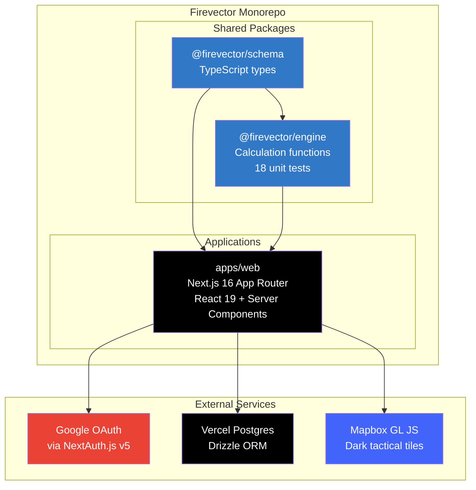
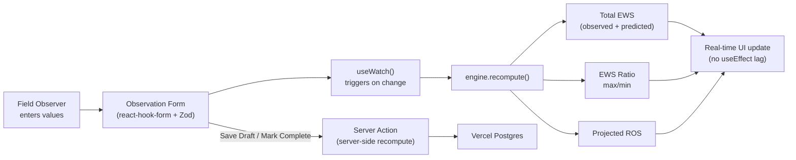
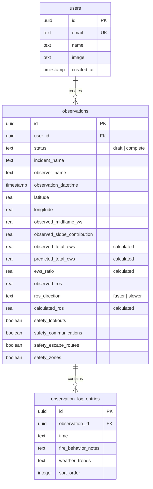

# Firevector

**Wildfire observation intelligence for the field. Free, open-source, built for firefighters.**

[](https://firevector.org)

[](LICENSE)
[](https://github.com/bgorzelic/firevector/actions/workflows/ci.yml)
[](https://www.typescriptlang.org/)
[](https://nextjs.org/)
[](https://www.w3.org/WAI/WCAG21/quickref/)

---

## The Problem

Every fire season, incident commanders and field observers across the country record wind speeds, slope contributions, and rate-of-spread observations on **paper worksheets** -- then run the math by hand. In a fast-moving wildfire, those minutes matter. A miscalculation on Effective Wind Speed can mean the difference between a safe operation and a burnover.

## The Solution

Firevector digitizes the [NWCG fire behavior observation form](https://www.nwcg.gov/) and **computes derived fields instantly** -- Effective Wind Speed (EWS), EWS ratios, and projected Rate of Spread (ROS) update in real time as values are entered. No paper. No manual math. No delay.

Built for **Cal OES** and the broader firefighting community. Free forever -- no subscriptions, no paywalls, no ads.

---

## Features

| Feature | Description |
|---------|-------------|
| **Real-time calculations** | EWS, EWS Ratio, and Projected ROS compute instantly as you type -- powered by a pure TypeScript calculation engine with 18 unit tests |
| **NWCG-standard form** | Digitized observation form matching the worksheets fire crews already use in the field |
| **LCES safety checklist** | Live safety status indicator -- Lookouts, Communications, Escape Routes, Safety Zones -- with visual confirmation when all four are in place |
| **Interactive map** | Mapbox GL JS dark map with amber observation pins, click-to-view popups showing EWS Ratio and Projected ROS |
| **Command center dashboard** | Stats cards, observation table, and map view -- all in a dark tactical UI designed for readability |
| **Google OAuth** | One-click sign-in with any Google account. No passwords to manage |
| **Draft/Complete workflow** | Save incomplete observations as drafts. Validation only enforced on completion |
| **Mobile-ready** | Responsive design with bottom navigation, collapsible map, and touch-friendly targets for field use |
| **WCAG 2.1 AA** | Accessible by design -- skip navigation, ARIA labels, focus management, screen reader announcements for live calculations |
| **Observation history** | All observations persisted in Vercel Postgres with full edit capability |

---

## Architecture



### Calculation Data Flow



### Database Schema



---

## Tech Stack

| Layer | Technology | Why |
|-------|-----------|-----|
| **Framework** | Next.js 16 (App Router) | Server Components + Server Actions for a fast, secure full-stack experience |
| **Language** | TypeScript 5.7 (strict) | End-to-end type safety from database to UI |
| **UI** | Tailwind CSS v4 + shadcn/ui (New York) | Utility-first CSS with accessible Radix primitives |
| **Theme** | oklch color system + next-themes | Dark tactical default with light and system modes |
| **Auth** | NextAuth.js v5 + DrizzleAdapter | Google OAuth with database-backed sessions |
| **Database** | Vercel Postgres (Neon) + Drizzle ORM | Serverless PostgreSQL with type-safe, zero-overhead queries |
| **Maps** | react-map-gl v8 + Mapbox GL JS | Hardware-accelerated maps with dark tiles |
| **Forms** | react-hook-form + Zod v4 | Performant forms with schema validation |
| **Calculations** | @firevector/engine | Pure TypeScript fire math -- zero dependencies, null-safe |
| **Testing** | Vitest | 18 unit tests covering all calculation edge cases |
| **CI/CD** | GitHub Actions + Vercel | Automated lint, typecheck, test, and deploy pipeline |
| **Hosting** | Vercel (Edge) | Global CDN with serverless functions at firevector.org |

---

## Project Stats

| Metric | Value |
|--------|-------|
| **Lines of code** | ~4,900 |
| **Source files** | 59 |
| **React components** | 33 |
| **Commits** | 23 |
| **Unit tests** | 18 (calculation engine) |
| **Build time** | ~5 seconds (Turbopack) |
| **Lighthouse Performance** | Optimized for Core Web Vitals |

---

## Quick Start

**Prerequisites:** Node.js 22+, npm

```bash
# Clone
git clone https://github.com/bgorzelic/firevector.git
cd firevector

# Install all workspace dependencies
npm install

# Configure environment
cp apps/web/.env.local.example apps/web/.env.local
# Edit .env.local with your credentials (see below)

# Push database schema
npx drizzle-kit push --config=apps/web/drizzle.config.ts

# Start dev server
npm run dev
```

### Environment Variables

| Variable | Source | Required |
|----------|--------|----------|
| `POSTGRES_URL` | Vercel Postgres dashboard | Yes |
| `AUTH_SECRET` | `npx auth secret` | Yes |
| `AUTH_URL` | Your deployment URL | Yes |
| `GOOGLE_CLIENT_ID` | [Google Cloud Console](https://console.cloud.google.com/) | Yes |
| `GOOGLE_CLIENT_SECRET` | Google Cloud Console | Yes |
| `NEXT_PUBLIC_MAPBOX_TOKEN` | [Mapbox](https://account.mapbox.com/) | No (map shows placeholder) |

### Run Tests

```bash
# Engine calculation tests
npm run test:engine

# All tests
npm test
```

---

## Documentation

| Document | Description |
|----------|-------------|
| [Architecture](docs/architecture.md) | System design, auth flow, component hierarchy (with Mermaid diagrams) |
| [Domain Model](docs/domain-model.md) | Fire behavior concepts explained -- EWS, ROS, LCES for non-firefighters |
| [Deployment Guide](docs/deployment.md) | Step-by-step Vercel deployment with environment variable setup |
| [Contributing](CONTRIBUTING.md) | Local setup, code style, PR process |
| [Project Brief](docs/project-brief.md) | How this project was built -- timeline, cost, and methodology |

---

## How It Was Built

Firevector was designed, planned, and built in a **single session** using AI-assisted development with Claude Code (Anthropic). The entire project -- from brainstorming the design to deploying to production at firevector.org -- was completed in approximately **2.5 hours**.

See [docs/project-brief.md](docs/project-brief.md) for the full breakdown of timeline, costs, and methodology.

---

## Contributing

Firevector is open source and we welcome contributions from developers, firefighters, GIS specialists, and anyone who wants to help. See [CONTRIBUTING.md](CONTRIBUTING.md) for setup instructions.

**Ideas for contribution:**
- Mobile native app (React Native)
- Offline mode with service worker sync
- Weather auto-population from Open-Meteo
- PDF export of completed observations
- Multi-language support (Spanish, etc.)
- Integration with CAL FIRE dispatch systems

---

## License

[MIT](LICENSE) -- Copyright (c) 2026 Brian Gorzelic / [AI Aerial Solutions](https://aiaerialsolutions.com)

Free to use, modify, and distribute. Built for the firefighting community.

---

## Acknowledgments

- **[Cal OES](https://www.caloes.ca.gov/)** -- California Governor's Office of Emergency Services, whose mission inspired this project
- **[NWCG](https://www.nwcg.gov/)** -- National Wildfire Coordinating Group, for the fire behavior observation standards Firevector digitizes
- **The firefighting community** -- The brave men and women on the line who protect lives and land every fire season. This tool is for you.
- **[Anthropic](https://anthropic.com)** -- Claude Code AI-assisted development made this possible in a single session

---

<p align="center">
  <strong>Firevector</strong> -- Wildfire Observation Intelligence<br/>
  <a href="https://firevector.org">firevector.org</a> | <a href="https://github.com/bgorzelic/firevector">GitHub</a> | MIT Licensed
</p>
