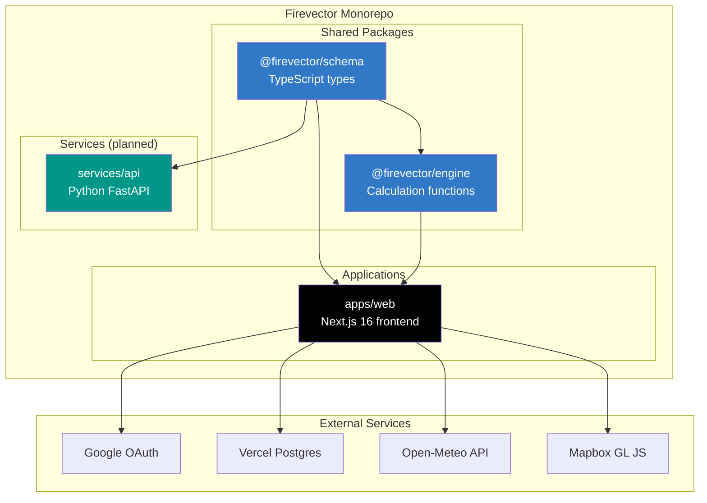
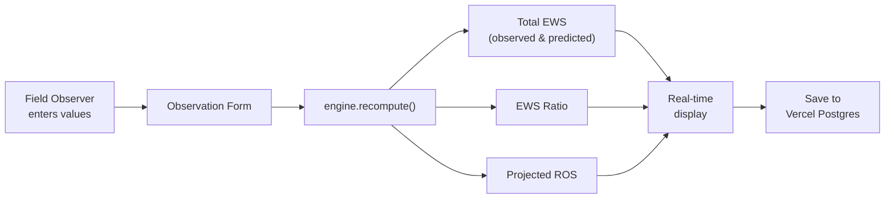

# :fire: Firevector

**Real-time fire behavior calculations for the field. Built for firefighters, by people who care.**

[](LICENSE)
[](https://github.com/bgorzelic/firevector/actions/workflows/ci.yml)
[](https://www.typescriptlang.org/)
[](https://nextjs.org/)

---

## What is Firevector?

Firevector is an open-source wildfire observation tool that digitizes the [NWCG fire behavior observation form](https://www.nwcg.gov/). Every season, fire crews across the country record wind speeds, slope contributions, and rate-of-spread observations on paper worksheets, then run the math by hand. Firevector does that math instantly -- computing Effective Wind Speed, EWS ratios, and projected Rate of Spread the moment values are entered.

This project was created for **Cal OES** and the broader firefighting community. Wildfire decisions happen fast: whether to order more resources, where to set escape routes, when to issue evacuations. Firevector gives incident commanders and field observers the derived numbers they need, right when they need them, on any device with a browser.

Firevector is and always will be **free**. No subscriptions, no paywalls, no ads. Firefighters risk their lives to protect communities. The least we can do is give them good tools.

---

## Features

- **Instant fire behavior calculations** -- EWS, EWS ratio, and projected ROS computed in real time as you type
- **NWCG-standard form** -- Digitized observation form matching the worksheets fire crews already know
- **LCES safety audit** -- Built-in Lookouts, Communications, Escape Routes, and Safety Zones checklist on every observation
- **Weather integration** -- Auto-populated weather data from Open-Meteo based on GPS location
- **Map-based observation** -- Mapbox GL JS map for pinpointing observation locations
- **Google OAuth sign-in** -- Secure authentication, no passwords to remember
- **Observation history** -- Persistent storage of all observations with draft/complete status tracking
- **Mobile-friendly** -- Responsive design for use on phones and tablets in the field
- **Offline-capable architecture** -- Calculation engine runs entirely client-side with no network dependency

---

## Architecture



### Data Flow



---

## Quick Start

**Prerequisites:** Node.js 22+, npm, a [Mapbox](https://www.mapbox.com/) access token, and [Google OAuth](https://console.cloud.google.com/) credentials.

```bash
# 1. Clone the repository
git clone https://github.com/bgorzelic/firevector.git
cd firevector

# 2. Install dependencies
npm install

# 3. Set up environment variables
cp apps/web/.env.example apps/web/.env.local
# Edit .env.local with your Mapbox token, Google OAuth credentials,
# and database connection string

# 4. Push the database schema
npx drizzle-kit push --config=apps/web/drizzle.config.ts

# 5. Start the dev server
npm run dev
```

Open [http://localhost:3000](http://localhost:3000) and start recording observations.

---

## Tech Stack

| Layer | Technology | Purpose |
|-------|-----------|---------|
| **Framework** | Next.js 16 | Full-stack React with App Router |
| **Language** | TypeScript 5.7 (strict) | Type-safe codebase |
| **Styling** | Tailwind CSS v4 + shadcn/ui | Utility-first CSS with accessible components |
| **Auth** | NextAuth.js v5 | Google OAuth sign-in |
| **Database** | Vercel Postgres + Drizzle ORM | Serverless PostgreSQL with type-safe queries |
| **Maps** | Mapbox GL JS | Interactive observation mapping |
| **Weather** | Open-Meteo API | Real-time weather data (free, no API key) |
| **Calculations** | @firevector/engine | Pure TypeScript, zero-dependency fire math |
| **Testing** | Vitest | Fast unit tests for calculation engine |
| **Deployment** | Vercel | Zero-config hosting with edge functions |

---

## Documentation

- [Architecture](docs/architecture.md) -- System design, auth flow, database ERD, component hierarchy
- [Deployment Guide](docs/deployment.md) -- Step-by-step Vercel deployment with environment variables
- [Domain Model](docs/domain-model.md) -- Fire behavior concepts explained for non-firefighters
- [Contributing](CONTRIBUTING.md) -- Local setup, code style, PR process

---

## Contributing

We welcome contributions from developers, firefighters, and anyone who wants to help. See [CONTRIBUTING.md](CONTRIBUTING.md) for setup instructions and guidelines.

---

## License

[MIT](LICENSE) -- Copyright (c) 2026 Brian Gorzelic / AI Aerial Solutions

---

## Acknowledgments

- **[Cal OES](https://www.caloes.ca.gov/)** -- California Governor's Office of Emergency Services, whose mission inspired this project
- **[NWCG](https://www.nwcg.gov/)** -- National Wildfire Coordinating Group, for the fire behavior observation standards that Firevector digitizes
- **The firefighting community** -- The brave men and women on the line who protect lives and land every fire season. This tool is for you.
