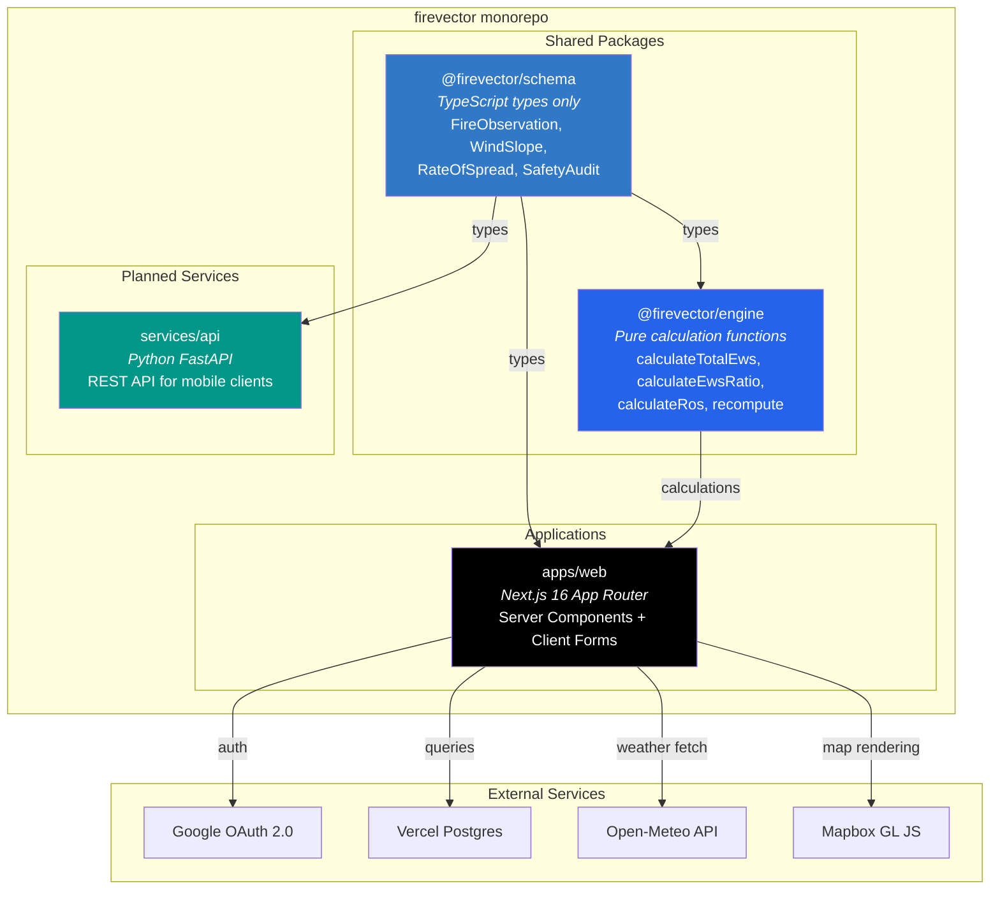
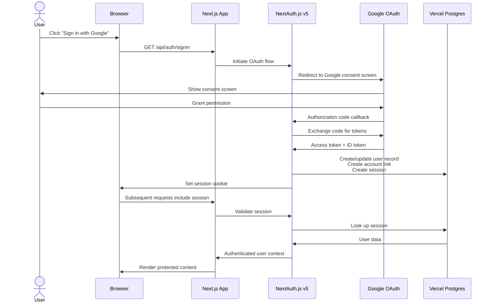
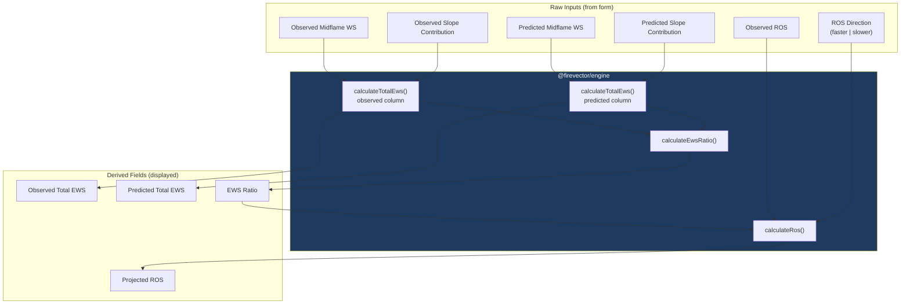
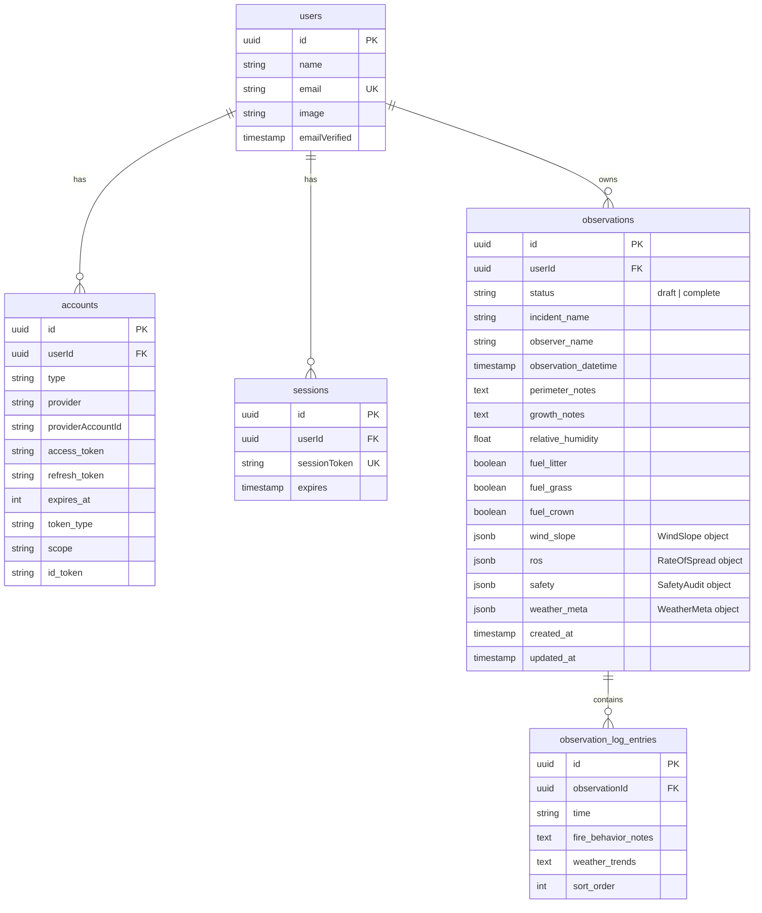
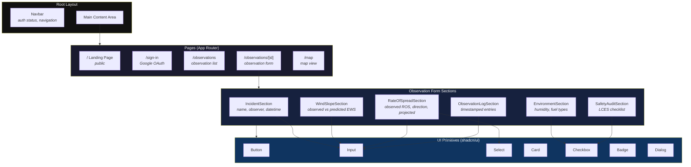

# Architecture

This document describes the system architecture of Firevector, including package relationships, authentication flow, calculation pipeline, database design, and component hierarchy.

## System Architecture

Firevector is an npm workspaces monorepo with shared packages consumed by application layers.



### Package Dependency Graph

```
@firevector/schema    (zero dependencies -- types only)
       |
       v
@firevector/engine    (depends on schema for type imports)
       |
       v
   apps/web           (depends on schema + engine)
```

The schema package has no runtime dependencies. The engine package imports types from schema but has no other runtime dependencies -- its calculation functions are pure TypeScript with zero external packages. This means the calculation engine can run entirely client-side with no network calls.

## Authentication Flow

Firevector uses NextAuth.js v5 with Google OAuth for authentication.



### Route Protection

- **Public routes:** Landing page, sign-in page
- **Protected routes:** `/observations/*`, `/map`, `/settings` -- require active session
- **API routes:** Server actions validate session before database operations
- Unauthenticated users are redirected to the sign-in page

## Calculation Flow

The engine's `recompute()` function is the central calculation entrypoint. It takes raw inputs and produces all derived fields in a single pass.



### Null Propagation

Every calculation function returns `null` when any required input is `null`. This means:

- Partially filled forms display calculated values only where all inputs are present
- No exceptions are thrown for incomplete data
- The UI can simply show a blank or placeholder for any `null` result

## Database ERD



### Design Decisions

- **JSONB columns** for `wind_slope`, `ros`, `safety`, and `weather_meta` -- these are structured objects that are always read and written as a whole, not queried individually. JSONB keeps the schema simple while preserving type safety through Drizzle ORM.
- **Separate `observation_log_entries` table** -- log entries are a variable-length list that benefits from normalized storage for ordering and individual updates.
- **NextAuth tables** (`users`, `accounts`, `sessions`) follow the [NextAuth.js Drizzle adapter schema](https://authjs.dev/getting-started/adapters/drizzle).

## Component Hierarchy



### Key Patterns

- **Server Components by default** -- Pages and layouts are React Server Components. Only form sections that need interactivity are Client Components (`"use client"`).
- **Server Actions for mutations** -- Form submissions call Next.js Server Actions, which validate the session and write to the database.
- **Engine runs client-side** -- The `recompute()` function runs in the browser on every input change for instant feedback. The server re-validates on save.
- **Optimistic updates** -- Form state updates immediately in the UI while the server action processes in the background.
